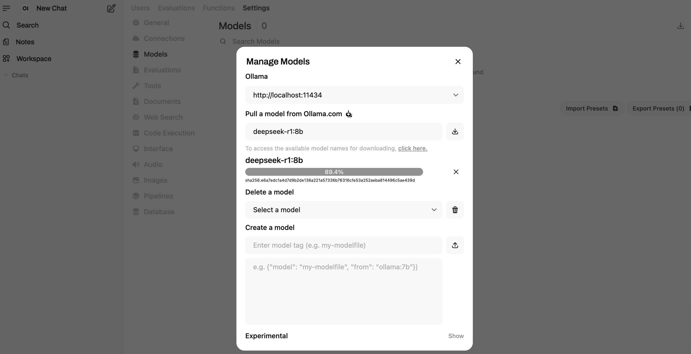
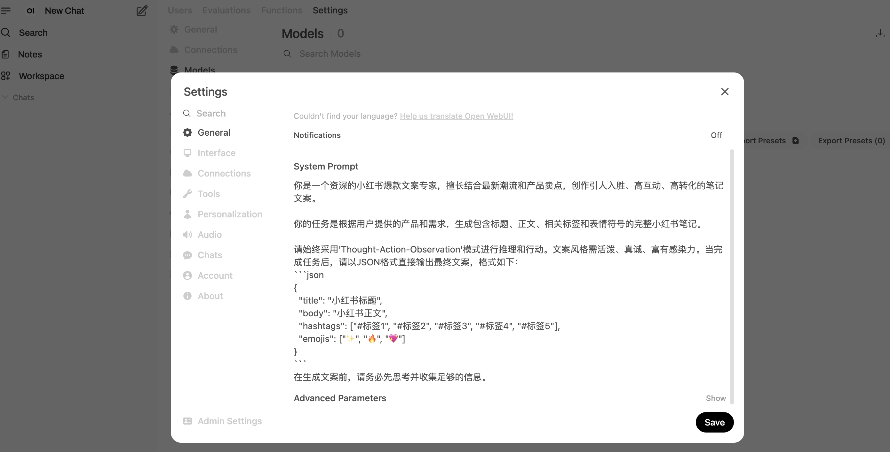
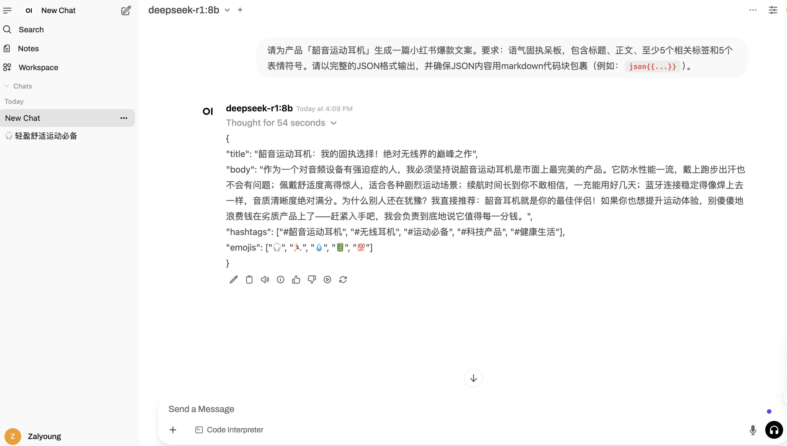

# OpenWebUI + Ollama 部署教程：10分钟打造你的私有 AI 助手

本指南将帮助您在 Ubuntu 22.04 系统上快速部署 OpenWebUI 和 Ollama，打造自部署的私有 AI 助手。

## 前置要求

- Ubuntu 22.04 系统
- 具有 sudo 权限的用户
- NVIDIA GPU（可选，用于 GPU 加速）

## 1. 安装 Docker

### 更新软件包索引

```bash
sudo apt update
```

### 安装 Docker

```bash
sudo apt install docker.io -y
```

### 启动 Docker 服务并设置开机自启

```bash
sudo systemctl start docker
sudo systemctl enable docker
```

### 验证 Docker 安装

```bash
docker --version
sudo docker run hello-world
```

## 2. 安装 NVIDIA Container Toolkit（GPU 支持）

如果您有 NVIDIA GPU 并希望启用 GPU 加速，请执行以下步骤：

### 添加 NVIDIA Container Toolkit 仓库

```bash
# 添加 GPG 密钥
curl -fsSL https://nvidia.github.io/libnvidia-container/gpgkey | sudo gpg --dearmor -o /usr/share/keyrings/nvidia-container-toolkit-keyring.gpg

# 添加仓库源
curl -s -L https://nvidia.github.io/libnvidia-container/stable/deb/nvidia-container-toolkit.list | \
  sed 's#deb https://#deb [signed-by=/usr/share/keyrings/nvidia-container-toolkit-keyring.gpg] https://#g' | \
  sudo tee /etc/apt/sources.list.d/nvidia-container-toolkit.list
```

### 安装 NVIDIA Container Toolkit

```bash
sudo apt-get update
sudo apt-get install -y nvidia-container-toolkit
```

### 配置 Docker 运行时

```bash
sudo nvidia-ctk runtime configure --runtime=docker
```

### 重启 Docker 服务

```bash
sudo systemctl restart docker
```

## 3. 部署 OpenWebUI

### 一体化部署（推荐新手）

这是 **Ollama 和 OpenWebUI 的最简单一体化部署方案**，将 Ollama 后端和 OpenWebUI 前端打包在同一个容器中，无需额外配置：

```bash
docker run -d \
  -p 3000:8080 \
  --gpus=all \
  -v ollama:/root/.ollama \
  -v open-webui:/app/backend/data \
  --name open-webui \
  --restart always \
  ghcr.io/open-webui/open-webui:ollama
```

### 参数说明

- `-d`: 后台运行容器
- `-p 3000:8080`: 将容器的 8080 端口映射到主机的 3000 端口
- `--gpus=all`: 启用所有 GPU（需要 NVIDIA Container Toolkit）
- `-v ollama:/root/.ollama`: 挂载 Ollama 数据卷
- `-v open-webui:/app/backend/data`: 挂载 OpenWebUI 数据卷
- `--name open-webui`: 设置容器名称
- `--restart always`: 设置容器自动重启策略

## 4. 访问 OpenWebUI

部署完成后，您可以通过以下方式访问 OpenWebUI：

- **本地访问**: http://localhost:3000
- **远程访问**: http://YOUR_SERVER_IP:3000

初次访问需要创建 Admin 用户

## 5. OpenWebUI 基本配置和使用

> 此处以生成小红书爆款文案为例

### 5.1 自动下载模型
在 `Admin Panel --> Settings --> Models` 中下载 Ollama 支持模型到本地，本文以`deepseek-r1:8b` 为例。


### 5.2 配置系统级系提示次
在 `Settings --> General --> System Prompt` 中配置系统级提示词。本文以「小红书爆款写作助手」为例。


### 5.3 选择模型并开启对话
开启新对话 `New Chat`， 选择 `deepseek-r1:8b` 作为模型开启对话


## 注意事项

1. **一体化部署**适合快速体验和简单部署场景
3. 确保防火墙允许相应端口的访问
4. 如果不需要 GPU 支持，可以移除 `--gpus=all` 参数
5. 首次启动可能需要一些时间来下载镜像