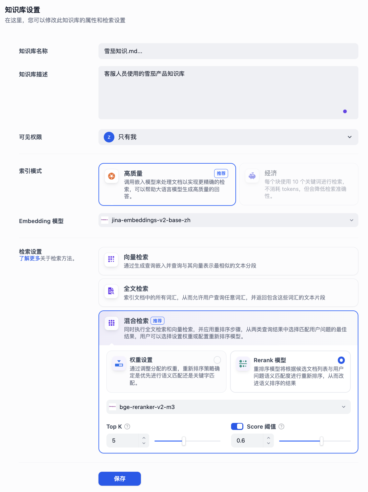
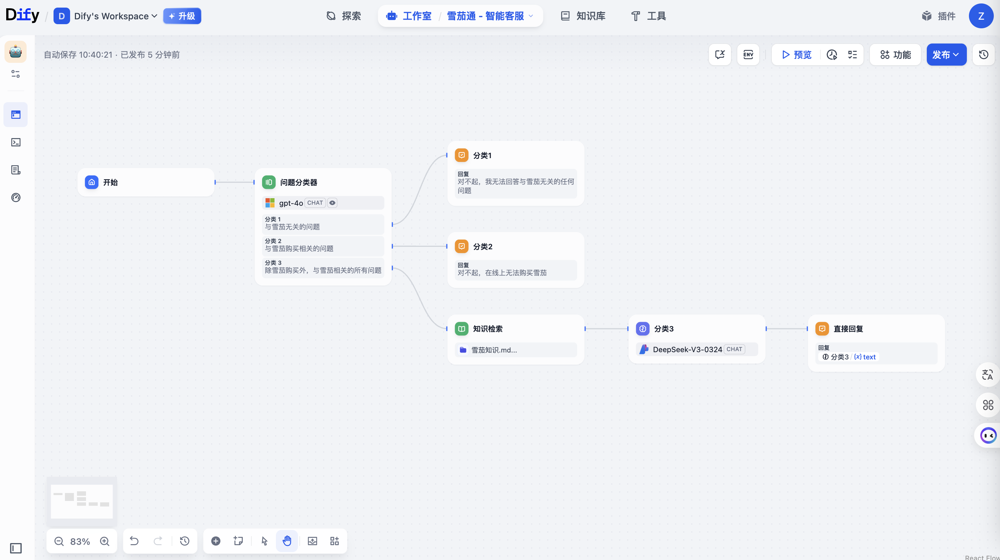

根据您提供的截图内容，我来帮您编写基于 Dify 构建智能客服的作业文档：

# 基于 Dify 构建雪茄智能客服系统

## 项目概述

本项目基于 Dify 平台构建了一个专业的雪茄智能客服系统，通过知识库检索和智能分类，为用户提供专业的雪茄咨询服务。

## 一、Dify 知识库创建


### 1.1 知识库基础配置

**步骤说明：**
1. 在 Dify 平台创建新的知识库
2. 设置知识库名称为 `雪茄知识.md`
3. 添加知识库描述：`客服人员使用的雪茄产品知识库`
4. 设置可见权限为"只有我"

### 1.2 索引模式配置

**关键配置：**
- **索引模式**：选择"高质量"模式
  - 调用嵌入模型来处理文档以实现更精确的检索
  - 帮助大语言模型生成高质量的回答
- **Embedding 模型**：`jina-embeddings-v2-base-zh`

### 1.3 检索设置优化

**检索策略：**
- 选择**混合检索**（推荐）
  - 同时执行全文检索和向量检索
  - 应用重排序步骤优化结果
- **Rerank 模型**：`bge-reranker-v2-m3`
- **Top K**：5
- **Score 阈值**：0.6

## 二、Dify 应用创建（Chatflow 模式）

### 2.1 应用基础设置

**步骤说明：**
1. 创建新的 Chatflow 应用
2. 应用名称：`雪茄通 - 智能客服`
3. 选择工作流模式进行智能对话设计



### 2.2 工作流结构设计

**核心节点：**
1. **开始节点**：接收用户输入
2. **问题分类器**：智能识别问题类型
3. **知识检索节点**：调用雪茄知识库
4. **LLM 节点**：基于知识库生成专业回答

## 三、Chatflow 编排和提示词优化
### 3.1 智能分类器设计

**分类策略：**
- **分类1**：与雪茄无关的问题 → 拒绝回答
- **分类2**：雪茄购买相关问题 → 说明无法在线购买
- **分类3**：雪茄知识咨询 → 调用知识库检索


### 3.2 优化系统提示词

#### 系统提示词（分类3 - 知识咨询）

```
作为一名专业的雪茄客服，热情友好的沟通是你的特长

请从获得的上下文内容中，回答开始{x} sys.query 内容中客户提出的问题

要求：
1. 涉及到任何违法、伦理、色情、暴力、战争、政治相关的问题，则拒绝回答
2. 用最简单易懂的方式解答客户提出的问题  
3. 遇到较为复杂的问题，可以利用比喻来讲解
```

#### 模型配置
- **模型**：DeepSeek-V3-0324 CHAT
- **上下文**：知识检索 result Array[Object]
- **温度**：适中设置，保证回答的准确性和友好性

### 3.3 分类逻辑优化

**分类1 - 无关问题处理：**
```
对不起，我无法回答与雪茄无关的任何问题
```

**分类2 - 购买咨询处理：**
```
对不起，在线上无法购买雪茄
```

## 四、最终对话验证


### 4.1 测试场景1：无关问题过滤

**用户问题：** "今天的天气如何？"

**系统回答：** "对不起，我无法回答与雪茄无关的任何问题"

**验证结果：** ✅ 成功识别并拒绝无关问题

### 4.2 测试场景2：购买咨询处理

**用户问题：** "在京东可以购买雪茄吗？"

**系统回答：** "对不起，在线上无法购买雪茄"

**验证结果：** ✅ 正确处理购买相关咨询

### 4.3 测试场景3：专业知识咨询

**用户问题：** "古巴雪茄非常知名，我即将跟朋友开一个 Party，请推荐一个雪茄的品牌和型号，并说明推荐原因"

**系统回答：**
```
根据您的需求，我为您推荐高希霸(Cohiba)的 Robusto(罗布图)型号，原因如下：

1. 品牌地位：高希霸是古巴最顶级的雪茄品牌之一，被誉为"雪茄中的劳斯莱斯"，非常适合高端聚会场合。

2. 口感适中：Robusto 尺寸(长度:124mm，环径:50)燃烧时间适中(约45-60分钟)，适合新手和老饕，带有奶油、木香和微微的甜味，接受度高。

3. 社交属性：外观经典，标识华丽，拿在手里很有派头，能成为聚会中的话题焦点。

如果预算有限，也可以考虑蒙特(Montecristo) No.4，性价比更高，味道同样优秀！

祝您的派对愉快，享受雪茄时光！
```

**验证结果：** ✅ 成功调用知识库，提供专业详细的回答