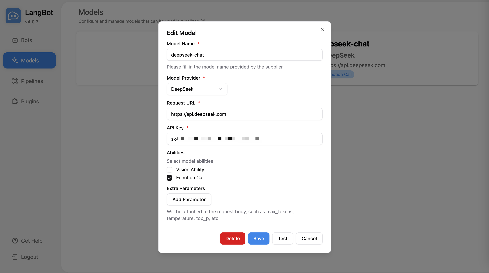
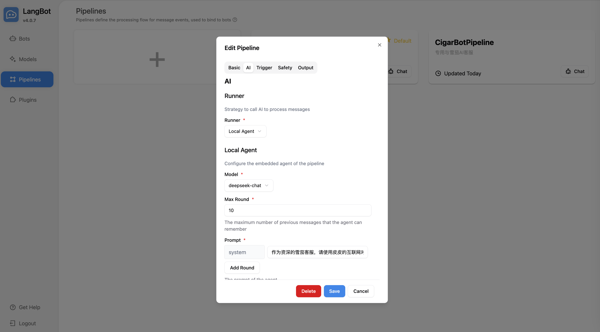
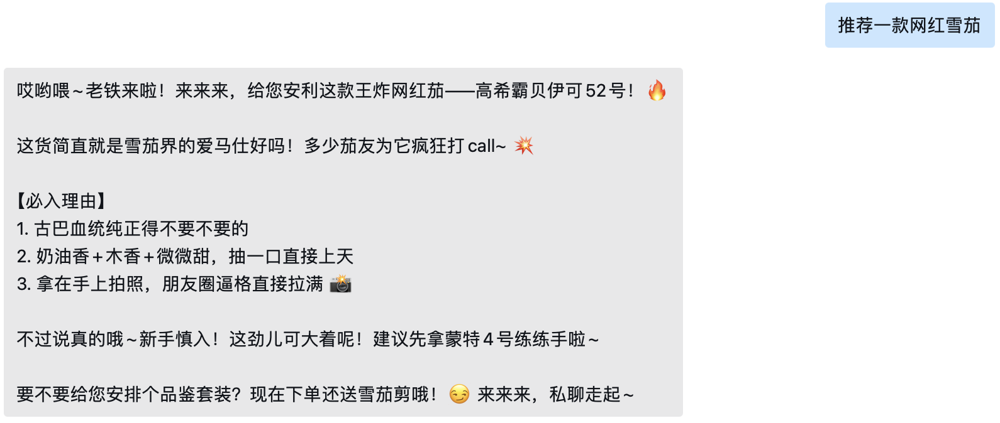

# 使用 LangBot 构建企业微信 AI 机器人

本文档仅用于个人研究和学习，指导使用 Docker 快速部署和配置 LangBot，并基于企业微信构建内部的 AI 对话机器人。
## 概述篇

LangBot 是一款简单易用的大模型即时通信机器人开发平台，在 GitHub 上已获得超过 12K Star，开源许可为 AGPL-3.0 license。平台支持 QQ、企业微信、飞书、Discord 等多种主流即时通信平台，同时也具备丰富的插件生态和多种模型的对接能力。

LangBot 具备以下特点：
- 大模型对话+Agent：支持多种大模型，适配群聊和私聊；具有多轮对话、工具调用、多模态能力，并深度适配 Dify。目前支持 QQ、QQ频道、企业微信、个人微信、飞书、Discord、Telegram 等平台。
- 高稳定性+功能完备：原生支持访问控制、限速、敏感词过滤等机制；配置简单，支持多种部署方式。支持多流水线配置，不同机器人用于不同应用场景。
- 插件扩展+活跃社区：支持事件驱动、组件扩展等插件机制；适配 Anthropic MCP 协议；目前已有数百个插件。
- Web 管理面板：支持通过 Web 浏览器管理 LangBot 实例，不再需要手动编写配置文件。

### LangBot 核心组件


LangBot 有着非常清晰的模块化架构设计，主要包含：
- Bots（机器人）：作为整个系统的入口和出口，负责与各种即时通信平台（QQ、微信、Discord等）进行交互，接收用户消息并返回响应。
- Pipelines（流水线）：系统的核心处理流程，包含四个关键阶段：
   1. Trigger（触发器）：负责判断消息是否需要处理，过滤无关消息
   2. Moderation（内容审核）：对输入内容进行安全检查和敏感词过滤
   3. AI（AI处理）：核心的 AI 处理模块，用于和大语言模型交互
   4. Output（输出处理）：对AI生成的内容进行后处理和格式化
- Models（模型服务）：外部的大语言模型服务，通过API请求与AI模块交互。

## 部署篇

### 环境要求

- **操作系统**: Linux (推荐 Ubuntu)
- **Docker**: 安装 Docker 和 Docker Compose
- **网络**: 可访问互联网下载 Docker 镜像
- **端口**: 服务器 5300 和 2280-2290 端口可被外部访问

### LangBot 部署

#### 1. 克隆项目代码

```bash
git clone https://github.com/RockChinQ/LangBot
cd LangBot
```

#### 2. 启动容器服务

使用 Docker Compose 启动服务：

```bash
docker-compose up -d
```

#### 3. 验证部署状态

检查容器运行状态：

```bash
docker ps
```

您应该看到类似以下输出（截取了部分内容）：
```
CONTAINER ID   IMAGE                     COMMAND            STATUS         NAMES
e38bc1ee1911   rockchin/langbot:latest   "uv run main.py"   Up 33 seconds  langbot
```

#### 4. 查看服务日志

实时查看服务日志：

```bash
docker-compose logs -f
```

以下是LangBot成功启动的日志（截取了部分内容）
```
langbot  | [06-23 22:49:31.019] mgr.py (39) - [INFO] : Initializing database...

langbot  | [06-23 22:49:31.048] mgr.py (57) - [INFO] : Creating initial metadata...
langbot  | [06-23 22:49:31.057] manager.py (73) - [INFO] : Loading all plugins...
langbot  | [06-23 22:49:31.070] modelmgr.py (56) - [INFO] : Loading models from db...
langbot  | [06-23 22:49:31.586] botmgr.py (198) - [INFO] : Loading bots from db...
langbot  | [06-23 22:49:31.590] pipelinemgr.py (227) - [INFO] : Loading pipelines from db...
langbot  | [06-23 22:49:32.410] show_notes.py (28) - [INFO] : Current Version: v4.0.7
langbot  | [06-23 22:49:32.410] app.py (185) - [INFO] : =======================================
langbot  | [06-23 22:49:32.410] app.py (185) - [INFO] : ✨ Access WebUI / 访问管理面板
langbot  | [06-23 22:49:32.410] app.py (185) - [INFO] :
langbot  | [06-23 22:49:32.411] app.py (185) - [INFO] : 🏠 Local Address: http://127.0.0.1:5300/
langbot  | [06-23 22:49:32.411] app.py (185) - [INFO] : 🌐 Public Address: http://<Your Public IP>:5300/
langbot  | [06-23 22:49:32.411] app.py (185) - [INFO] :
langbot  | [06-23 22:49:32.411] app.py (185) - [INFO] : 📌 Running this program in a container? Please ensure that the 5300 port is exposed
langbot  | [06-23 22:49:32.411] app.py (185) - [INFO] : =======================================
langbot  | [2025-06-23 22:49:32 +0800] [10] [INFO] Running on http://0.0.0.0:2290 (CTRL + C to quit)
langbot  | [2025-06-23 22:49:32 +0800] [10] [INFO] Running on http://0.0.0.0:5300 (CTRL + C to quit)
```

至此 LangBot 已部署完成，整个过程是不是特别简单？
## 配置篇

### 企业微信配置

#### 1. 登录企业微信管理后台
1. 需要使用管理员账号登录
2. 访问企业微信管理后台：https://work.weixin.qq.com/

#### 2. 获取企业ID
1. 在管理后台首页，找到 **我的企业** 部分
2. 在我的企业页面中记录下 **企业ID (CorpID)**，这是企微中企业的唯一标识

#### 3. 获取通讯录管理 Secret
1. 进入 **安全与管理** -> **管理工具** -> **通讯录同步** 页面
2. 记录 **Secret**


#### 4. 创建应用
1. 进入 **应用管理** → **应用** → **创建应用**
2. 填写应用信息：
   - 应用名称：例如 "CigarChatBot"
   - 应用简介：例如 "雪茄AI客服"
   - 应用Logo：上传应用图标
3. 选择可见范围（可以选择全部成员或指定部门/成员）
4. 创建完成后，记录下 **AgentID** 和 **Secret**


#### 5. 应用接收消息配置
1. 在对应的应用设置页面，找到 **接收消息** 设置
2. 启用 **API接收消息**
3. 设置回调URL：`http://您的服务器IP:2290/callback/command` 
4. 随机生成并记录 **Token** 和 **EncodingAESKey**


#### 6. 配置可信IP
1. 在对应的应用设置页面，找到 **企业可信IP** 配置
2. 添加您的 LangBot 服务器公网IP地址


#### 7. 企业微信配置参数汇总

完成以上步骤后，您将获得以下5个关键配置参数，这些参数会用到 LangBot 配置中

| 参数名称 | 说明 | 获取位置 |
|---------|------|----------|
| **CorpID** | 企业ID，企业唯一标识 | 我的企业 → 企业信息 |
| **Secret** | 应用Secret，用于调用应用API | 应用管理 → 应用详情 |
| **Token** | 消息回调验证Token | 应用设置 → 接收消息 |
| **EncodingAESKey** | 消息加密密钥 | 应用设置 → 接收消息 |
| **Contacts Secret** | 通讯录管理Secret | 安全管理 → 管理工具 → 通讯录同步 |


### LangBot 配置

LangBot 服务启动成功后，您可以通过以下地址访问 LangBot 的 Web 管理界面：

- **本地访问**: `http://127.0.0.1:5300/`
- **公网访问**: `http://<您的公网IP>:5300/`

#### 1. 初始化设置

1. **首次访问**: 访问 Web 界面时会提示进行初始化设置
2. **创建管理员账户**: 根据提示创建管理员用户名和密码
3. **登录系统**: 使用创建的账户登录管理界面

#### 2. 模型配置
模型将被流水线用于处理消息，您配置的第一个模型将被设置为默认流水线的模型。

1. 访问 **模型(Models)** 页面
2. 添加模型提供商，本文以 DeepSeek 为例
3. 配置模型名称，本文为 `deepseek-chat`，表示 DS-V3
4. 配置访问模型的 URL 和 API 密钥。使用的是DeepSeek 官方模型服务，可从 https://platform.deepseek.com/ 中创建并获取
5. 测试模型连接
6. 保存配置


#### 3. 流水线配置
LangBot 流水线控制了收到消息之后的处理流程，以及与大模型之间的信息交互。每个机器人可以绑定到一条流水线上，同一条流水线能被多个机器人绑定。LangBot 首次启动时会自动创建一个默认的流水线。创建机器人时，会自动绑定到默认流水线。创建第一个模型时，也会自动将其设置为默认流水线的模型。

本文会创建一个新的名为 CigarBotPipeline 的流水线为例
1. 访问 **流水线(Pipeline)** 页面
2. 创建流水线，输入名称和描述
3. 配置AI
    - 消息处理使用 Local Agent，意味着让 LangBot 自己去调LLM
    - Local Agent 选择之前已配置好的模型 deepseek-chat
    - 自定义 System Prompt，支持系统提示此的自定义。本例为"作为资深的雪茄客服，请使用皮皮的互联网对话风格开展聊天"
4. 配置触发器、安全和输出。如无特殊需求，保持默认即可
5. 保存配置



#### 4. 机器人配置
LangBot 机器人用于从消息平台接收消息事件，并调用流水线处理消息。

1. 访问 **机器人（Bots）** 页面
2. 创建新的机器人实例
3. 绑定之前创建的流水线（CigarBotPipeline）
4. 适配平台选择 **企业微信（WeCom）** 
5. 设置机器人参数和权限（参考上述的企业微信配置参数汇总小节）
   - Host和Port，如无特殊要求，保持默认即可
   - Corpid: "企业ID"
   - Secret: "应用Secret"
   - Token: "消息回调验证Token"
   - EncodingAESKy: "消息加密密钥EncodingAESKey"
   - Contacts Secret: "通讯录管理Secret"
6. 保存并启动机器人


## 使用篇
使用方式跟平常对话聊天一样，不同的是这次换成了AI。登陆企业微信客户端后，在 Worksapce 选择对应的机器人即可开启对话。

本次来了五轮对话：



## 总结
LangBot + DeepSeek + 企业微信的组合为您提供了一个强大、灵活且经济的企业 AI 解决方案。随着 AI 技术的不断发展，这个平台将为您的企业数字化转型提供更多可能性。

如果本教程对您有帮助，欢迎分享给更多需要的朋友。有任何问题或改进建议，请在评论区留言交流！
## 参考文档

- **LangBot 项目地址**: https://github.com/RockChinQ/LangBot
- **LangBot 文档地址**: https://docs.langbot.app
- **企业微信帮助中心**: https://open.work.weixin.qq.com/help

