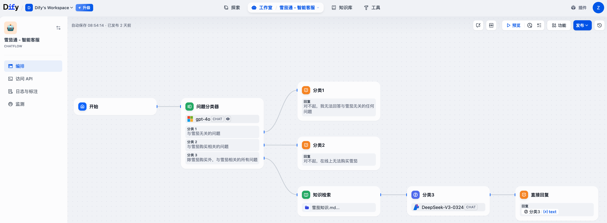

# 三步完成 LangBot 与 Dify 集成实现

随着生成式AI的快速发展，智能客服已成为了企业提升客户体验、降低成本的重要工具。本文将详细介绍如何通过三个简单步骤，快速实现 LangBot 与 Dify 的集成，构建一个以 Dify 作为后端知识库+企业微信作为前端入口的智能客服机器人。整个过程无需复杂的编程知识，仅需简单的配置即可完成。

## 前置条件

- 已完成 Dify 中应用的创建，本例使用 Chatflow 类型应用，名为「雪茄通-智能客服」
- 已完成 LangBot 中机器人的创建，本例使用企业微信对接，名为「CigarChatBot」

## 请求响应概览

## 第一步：获取 Dify API 权限

1. 登录 Dify 工作空间

登录 Dify 后访问工作空间下的「雪茄通-智能客服」应用

2. 进入 API 服务配置
在应用左侧导航栏中选择 **"访问 API"** 选项。在 API 访问页面，您将看到以下重要信息：

    - **API URL**：https://api.dify.ai/v1
    - **API Key**：app-42xxxxxxxxxxxxxxxxxxxx

> 注：如果没有 API Token 则点击创建一个

## 第二步：配置 LangBot Pipeline

1. 登录 LangBot 管理后台
2. 在左侧导航栏选择 "Pipelines"，点击 "+" 按钮创建新的 Pipeline
3. 填写 Pipeline 基本信息：
    - Pipeline 名称：DifyCigarPipeline
    - 描述：Dify RAG for Cigar customer service
    - 状态：启用
    
4. 配置 Dify Service API 参数
切换到 "AI" 配置标签，在 "Runner" 下拉菜单中选择 "Dify Service API"
    - Base URL：https://api.dify.ai/v1
    - App Type：Chat
    - API Key：您在第一步获取的完整API Key
    - CoT Convert：Original

5. 其他配置保持默认，确认所有配置信息无误后，保存配置

## 第三步：配置 LangBot Bot
1. 登录 LangBot 管理后台
2. 配置已经创建好的机器人 CigarChatBot
3. 将  **"Bind Pipeline"** 设置为第二步配置好的 **"DifyCigarPipeline"**
4. 保存配置

## 测试验证
通过三轮对话，可以看到 Bot 的响应遵循的是 Dify 中的 ChatFlow 应用设定

至此所有的配置已经完成，现在您已经拥有了一个功能完善的智能客服机器人，可以为您的客户提供专业的雪茄咨询服务。随着使用的深入，您还可以进一步优化 Dify 的知识库和对话策略，提升客服质量。