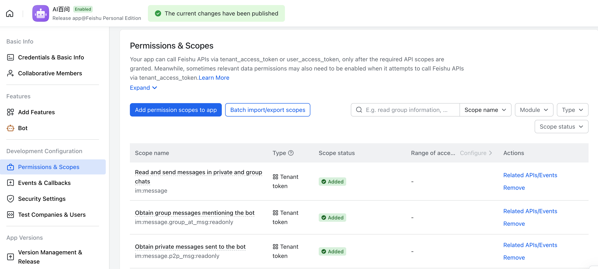
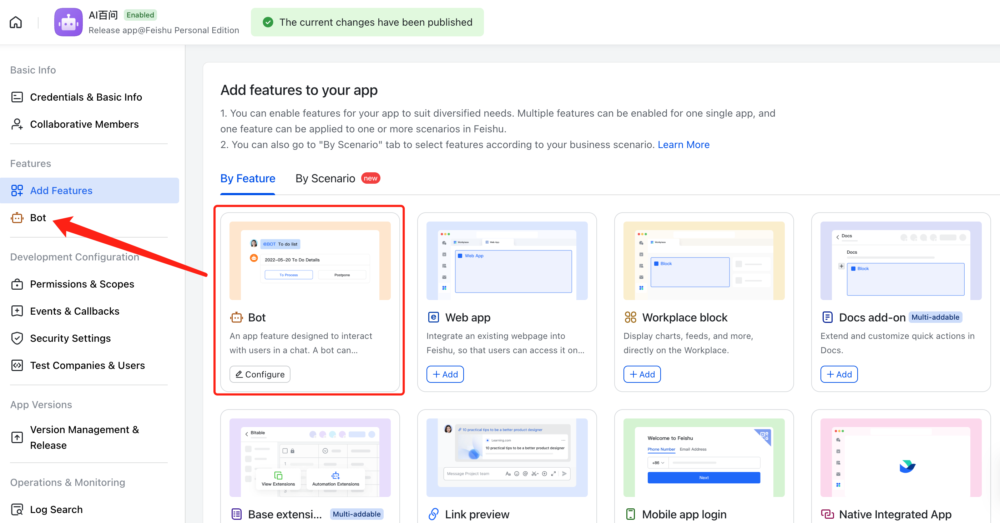
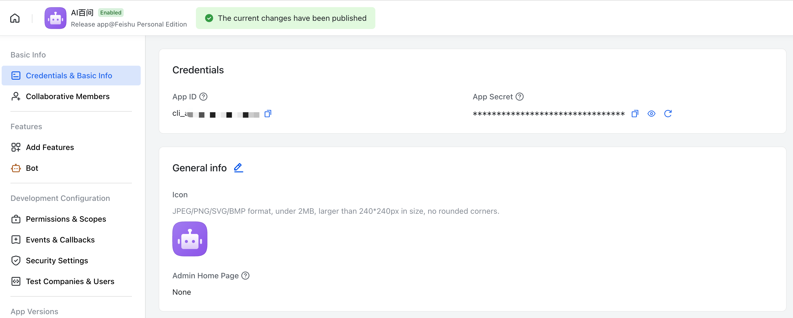
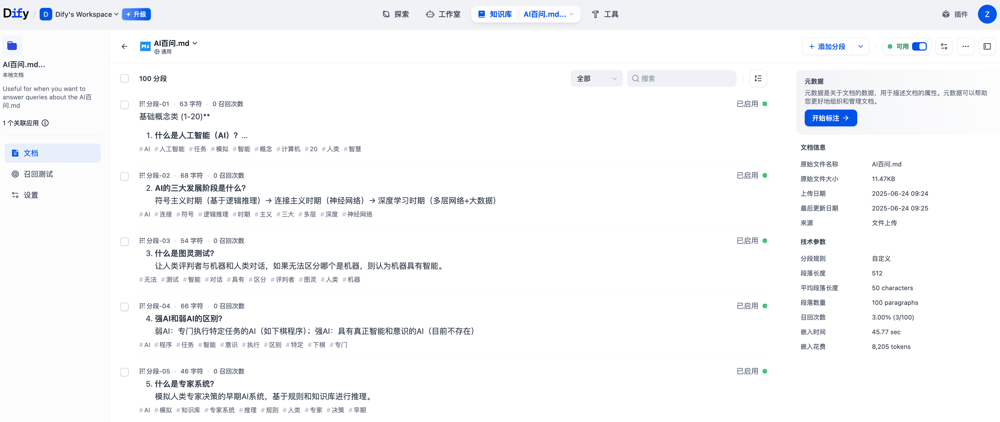
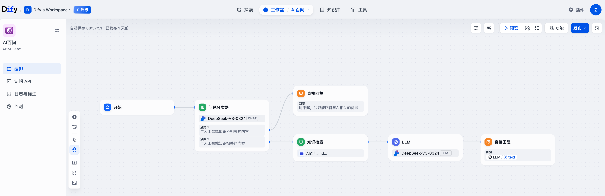
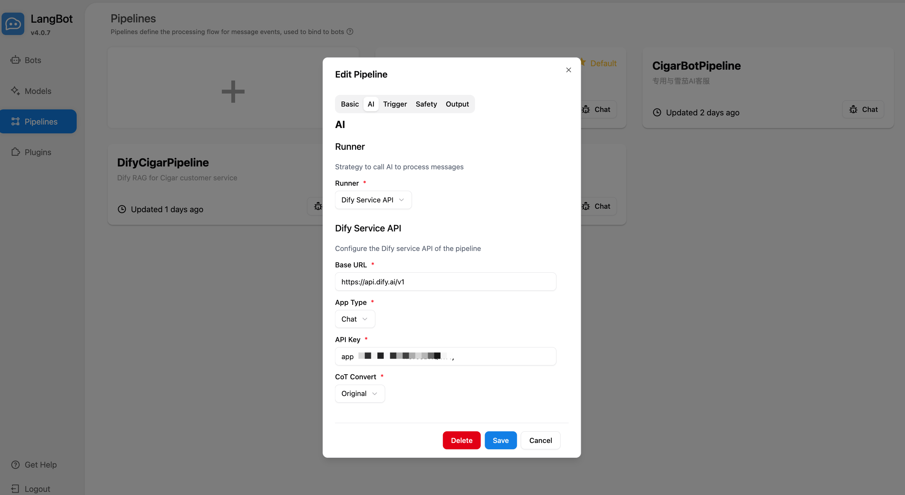
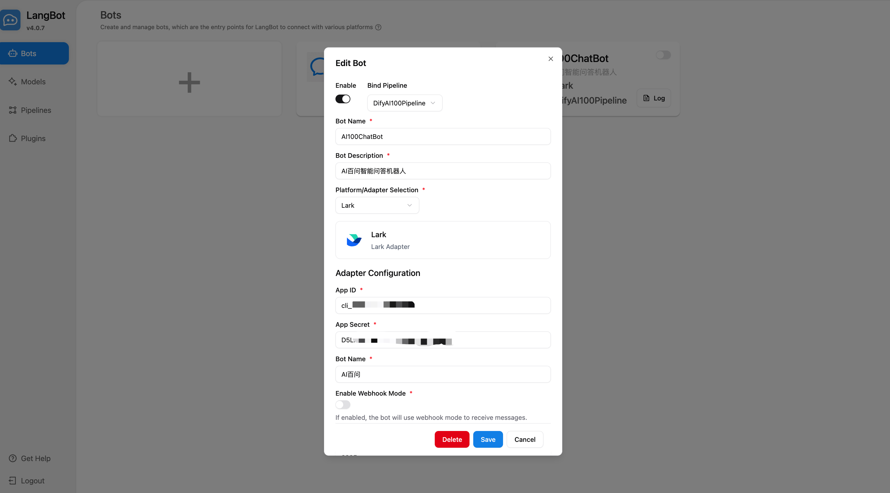
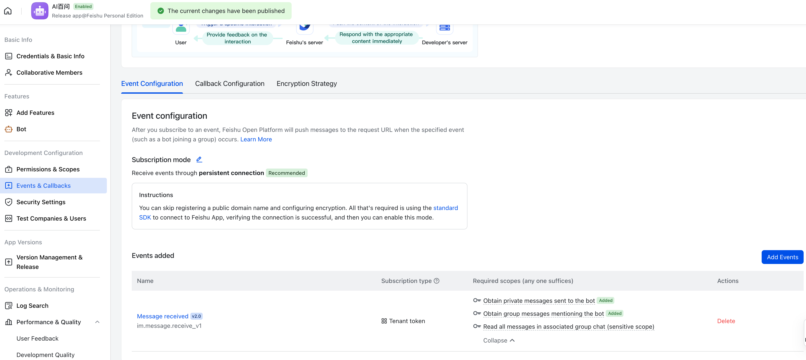
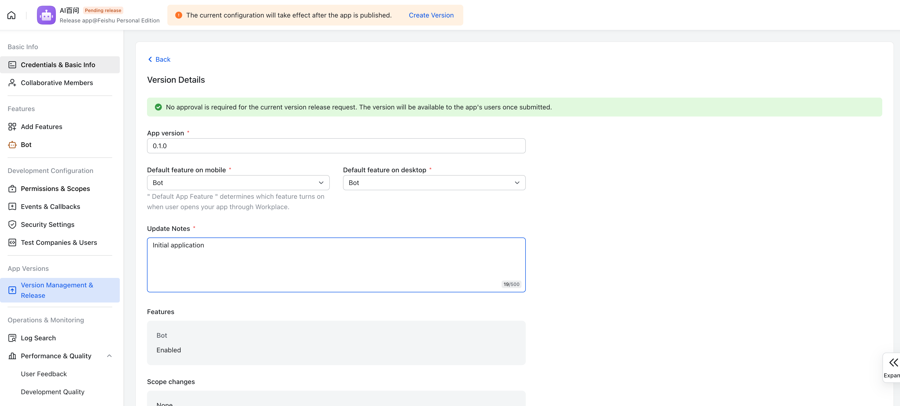
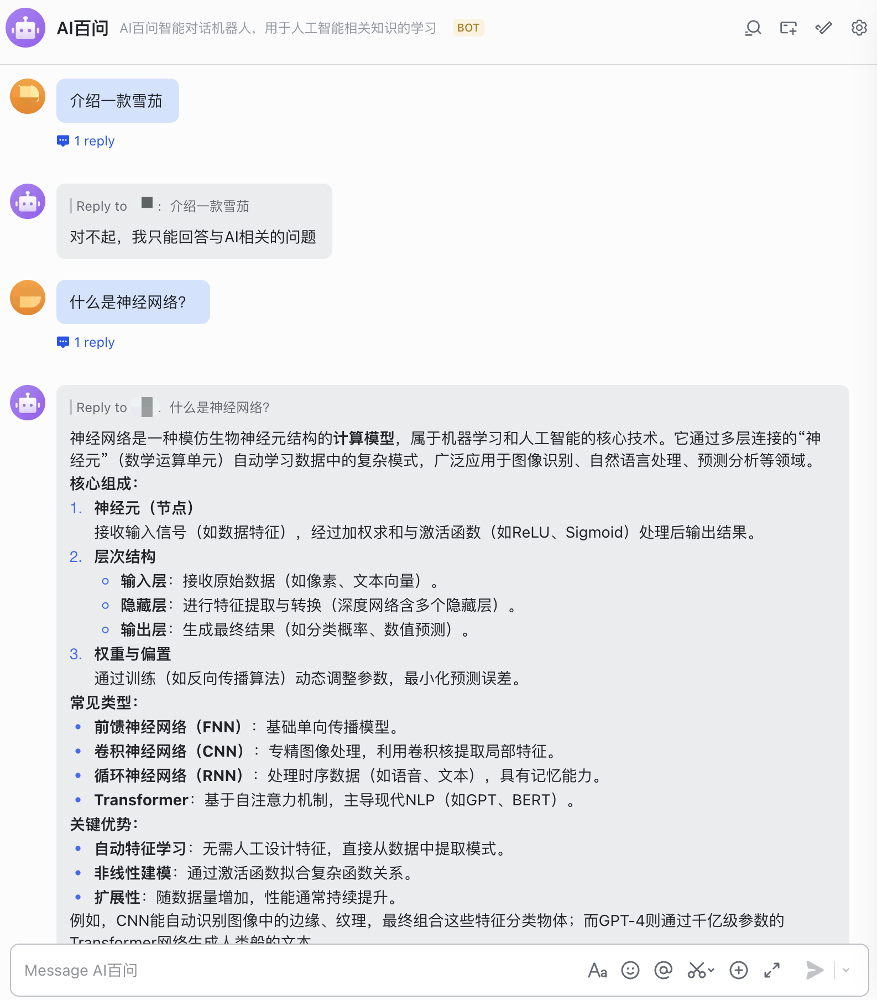

# LangBot 与飞书机器人集成

## 飞书应用配置

### 1. 登录飞书开放平台
需要使用管理员账号登录

访问飞书开放平台：https://open.feishu.cn/

### 2. 创建应用
在开放平台控制台中，点击"创建企业自建应用"

填写应用基本信息：
- **应用名称**：例如 "AI百问"
- **应用描述**：例如 "AI智能对话机器人，用于人工智能相关知识的学习"
- **应用图标**：上传应用Logo（支持JPEG/PNG/SVG/BMP格式，2MB以下，240×240px以上）

### 3. 配置应用权限
进入"权限管理"页面，添加以下必要权限：

**消息相关权限**：
- `im:message` - 获取与发送单聊、群组消息
- `im:message.group_at_msg:readonly` - 接受群内@机器人消息事件
- `im:message.p2p_msg:readonly` - 读取用户发给机器人的单聊消息

### 4. 添加应用功能
为应用添加机器人（Bot）功能

### 5. 获取应用凭证
在应用的"凭证与基础信息"页面，记录以下信息：
- **App ID**：应用唯一标识
- **App Secret**：应用密钥（点击查看并复制）

## Dify 应用配置

### 1. 登录 Dify
访问 Dify SaaS 平台：https://cloud.dify.ai

### 2. 创建 Dify 知识库
- 创建「AI百问」知识库
- 上传准备好的「AI百问 Markdown 文档」
- 配置文档的切片并执行嵌入

### 3. 创建 Dify 应用
- 创建 ChatFlow 类型的「AI百问」应用
- 编排全流程
  - 完成问题分类的节点设置
  - 完成知识检索的节点设置，引入之前创建好的「AI百问」知识库
  - 完成用于 RAG 对话的 LLM 节点设置
  - 完成回复内容相关的节点设置

## LangBot 机器人配置
访问 LangBot Web 控制台，一般为`http://<YOUR_IP_OR_DOMAIN_NAME>:5300`

### 1. 创建 LangBot Pipeline
访问 LangBot **流水线（Pipelines）** 页面
- 新建 Pileines
   - **名称**：DifyAI100Pipeline
   - **描述**：专用与 Dify AI100 智能对话机器人对接
   - **运行器**: Dify Service API
   - **基础URL**: https://api.dify.ai/v1
   - **应用类型**: Chat
   - **API密钥**：相对应 Dify 应用的密钥
   - **思维链处理**：原始

### 2. 创建 LangBot 机器人
访问 LangBot **机器人（Bots）** 页面
- 创建新的机器人实例
    - **机器人名称**：AI100ChatBot
    - **机器人描述**：AI百问智能问答机器人
    - **流水线绑定**：AIBotPipeline
    - **适配平台选择**： 飞书（Lark）
    - **App ID**: 飞书APP的唯一标识
    - **App Secret**: 飞书APP的密钥
    - **启用Webhook模式**: 不启用
- 保存并启动机器人

> 注：默认使用 WebSocket 长连接模式，对应下方的时间订阅中的长连接订阅。但某些情况下（如国际版飞书）不具有长连接模式，此时需要启用 Webhook 模式，对应将事件发送到开发者服务器模式。

## 发布飞书应用

### 1. 配置飞书应用事件订阅
进入"事件与回调"页面：

**事件配置**：
- 选择"通过持久连接接收事件"（推荐）
- 添加事件
   - 选择"接收消息 v2.0 (im.message.receive_v1)"
- 确保已启用所需的权限范围

### 2. 版本发布
在"版本管理与发布"页面：
- 设置应用版本号（如：0.1.0）
- 填写更新说明（如：初始应用）
- 设置默认功能为"机器人"
- 提交发布申请

## 测试验证
在飞书客户端中开启与机器人的对话

## 总结

飞书 + LangBot + Dify 是一个非常优雅的组合，通过飞书的企业级即时通信能力，结合 LangBot 的灵活配置和 Dify 的 RAG 及 Agent 能力，提供了一个强大、灵活且经济的企业 AI 智能对话机器人解决方案。
